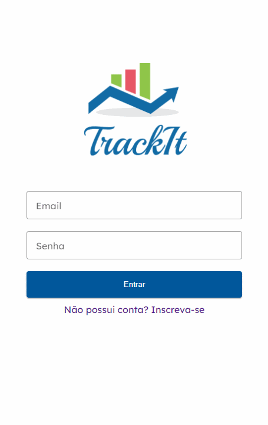

# Trackit-Angular-Spring
Trackit is a POC project developed in Angular and Java Spring. It functions as a web agenda to monitor tasks and deliver progress updates, demonstrating the integration of front-end and back-end technologies for effective task management.

